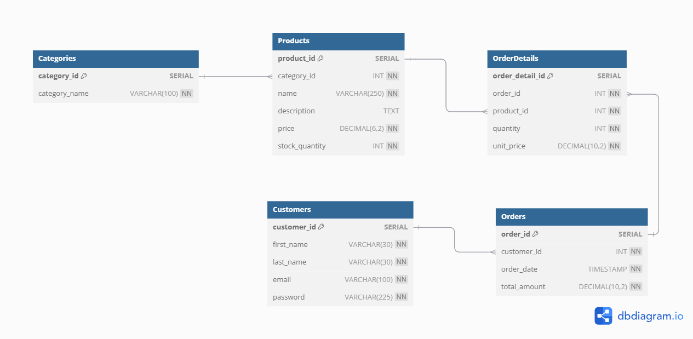

# E-Commerce Database Schema & Queries

## Overview

This project provides a relational database schema for an **E-Commerce System**, along with SQL queries to extract useful reports.

## Database Schema

The database consists of five main tables:

- **Categories**: Stores product categories.
- **Products**: Stores product details and links to categories.
- **Customers**: Stores customer details.
- **Orders**: Stores order details, including total amounts.
- **OrderDetails**: Stores details of each order, linking products to orders.

### ERD Diagram

 

## Database Schema Script

```sql
-- Create the database
CREATE DATABASE e-commerce;

-- Create the Categories table
CREATE TABLE Categories (
    category_id SERIAL PRIMARY KEY,
    category_name VARCHAR(100) UNIQUE CHECK(CHAR_LENGTH(category_name) > 3)
);

-- Create the Products table
CREATE TABLE Products (
    product_id SERIAL PRIMARY KEY,
    category_id INT,
    name VARCHAR(250) NOT NULL CHECK(CHAR_LENGTH(name) > 3),
    description TEXT,
    price DECIMAL(6, 2) NOT NULL CHECK(price > 0),
    stock_quantity INT NOT NULL DEFAULT 0,
    FOREIGN KEY (category_id) REFERENCES categories(category_id)
);

-- Create the Customers table
CREATE TABLE Customers (
    customer_id SERIAL PRIMARY KEY,
    first_name VARCHAR(30) NOT NULL CHECK (CHAR_LENGTH(first_name) > 2),
    last_name VARCHAR(30) NOT NULL CHECK (CHAR_LENGTH(last_name) > 2),
    email VARCHAR(100) UNIQUE NOT NULL,
    password VARCHAR(225) NOT NULL CHECK (CHAR_LENGTH(password) > 5)
);

-- Create the Orders table
CREATE TABLE Orders (
    order_id SERIAL PRIMARY KEY,
    customer_id INT,
    order_date TIMESTAMP NOT NULL DEFAULT CURRENT_TIMESTAMP,
    total_amount DECIMAL(10, 2) NOT NULL,
    FOREIGN KEY (customer_id) REFERENCES Customers (customer_id)
);

-- Create the OrderDetails table
CREATE TABLE OrderDetails (
    order_detail_id SERIAL PRIMARY KEY,
    order_id INT NOT NULL,
    product_id INT NOT NULL,
    quantity INT NOT NULL CHECK (quantity > 0),
    unit_price DECIMAL(10, 2) NOT NULL,
    FOREIGN KEY (order_id) REFERENCES Orders (order_id),
    FOREIGN KEY (product_id) REFERENCES Products (product_id)
);
```

## SQL Queries

### 1. Daily Revenue Report for a specific date

Query:

```sql
SELECT DATE(order_date) AS OrderDate, SUM(total_amount) AS DailyRevenue
FROM Orders
WHERE DATE(order_date) = '2023-10-21'
GROUP BY DATE(order_date);
```

### 2. Monthly Top-Selling Products Report

Query:

```sql
SELECT DATE_FORMAT(order_date, '%Y-%m') AS Month,
       (SELECT name FROM products P WHERE P.product_id = OD.product_id) AS ProductName,
       SUM(quantity) AS TotalQuantity
FROM orderdetails OD
JOIN orders O ON O.order_id = OD.order_id
WHERE DATE_FORMAT(order_date, '%Y-%m') = '2025-01'
GROUP BY product_id
ORDER BY TotalQuantity DESC;
```

### 3. Customers with Orders Totaling More Than \$500 in the Past Month

Query:

```sql
SELECT CONCAT(first_name,' ',last_name) AS CustomerName,
       SUM(total_amount) AS TotalAmount,
       order_date AS OrderDate
FROM orders O
JOIN customers C ON O.customer_id = C.customer_id
WHERE order_date < DATE_SUB(NOW(), INTERVAL 1 MONTH)
GROUP BY C.customer_id
HAVING SUM(total_amount) > 500;
```

## SQL Queries Before & After Optimization 

### 4. Total Number of Products in Each Category

**Query:**

```sql
SELECT c.category_id, c.category_name, COUNT(p.product_id) AS total_products
FROM categories c LEFT JOIN products p ON c.category_id=p.category_id
GROUP BY c.category_id, c.category_name
ORDER BY c.category_id, c.category_name;
```

**Execution Time Before Optimization:** 184.443 ms

**Execution Time After Optimization:** 87.015 ms

**Optimization Techniques:**

- Created indexes:

```sql
CREATE INDEX categories_index ON categories(category_id, category_name);
CREATE INDEX products_category_index ON products(category_id);
```

### 6. Top Customers by Total Spending

**Query:**

```sql
SELECT c.customer_id, c.first_name || ' ' || c.last_name AS full_name, SUM(o.total_amount) AS total_spending
FROM customers c JOIN orders o ON c.customer_id=o.customer_id
GROUP By c.customer_id
ORDER BY total_spending DESC
LIMIT 10;
```

**Execution Time Before Optimization:** 6331.932 ms

**Execution Time After Optimization:** 2599.446 ms

**Optimization Techniques:**

- Created indexes:

```sql
CREATE INDEX orders_customer_index ON orders(customer_id);
CREATE INDEX orders_total_amount_index ON orders(total_amount);
```

### 7. Most Recent Orders with Customer Information (1000 Orders)

**Query:**

```sql
SELECT o.order_id, o.order_date ,o.total_amount, c.customer_id, c.first_name ||' '|| c.last_name AS full_name, c.email
FROM orders o JOIN customers c ON o.customer_id = c.customer_id
ORDER BY o.order_date DESC 
LIMIT 1000;
```

**Execution Time Before Optimization:** 1014.651 ms


**Execution Time After Optimization:** 0.981 ms

**Optimization Techniques:**

- Created an index on order date:

```sql
CREATE INDEX orders_date_index ON orders(order_date);
```

### 8. List of Products with Low Stock (Less than 10)

**Query:**

```sql
SELECT product_id, name , stock_quantity FROM products
WHERE stock_quantity < 10 
ORDER BY stock_quantity ASC;
```

**Execution Time Before Optimization:** 111.096 ms

**Execution Time After Optimization:** 3.975 ms

**Optimization Techniques:**

- Created an index on stock quantity:

```sql
CREATE INDEX products_stock_quantity_index ON products(stock_quantity);
```

### 9. Revenue Generated by Each Product Category

&#x20;Calculate the revenue generated from each product category.

**Query:**

```sql
SELECT c.category_id, c.category_name, SUM(od.quantity * od.unit_price) AS total_revenue
FROM orderdetails od JOIN products p ON od.product_id=p.product_id
JOIN categories c ON c.category_id = p.category_id
GROUP BY c.category_id;
```

**Execution Time Before Optimization:** 9535.885 ms

**Execution Time After Optimization:** 5692.432 ms

**Optimization Techniques:**

- Partitioned the `orderdetails` table for improved performance.
- Created an index on `product_id`:

```sql
CREATE INDEX orderdetails_product ON orderdetails(product_id);
```

##

