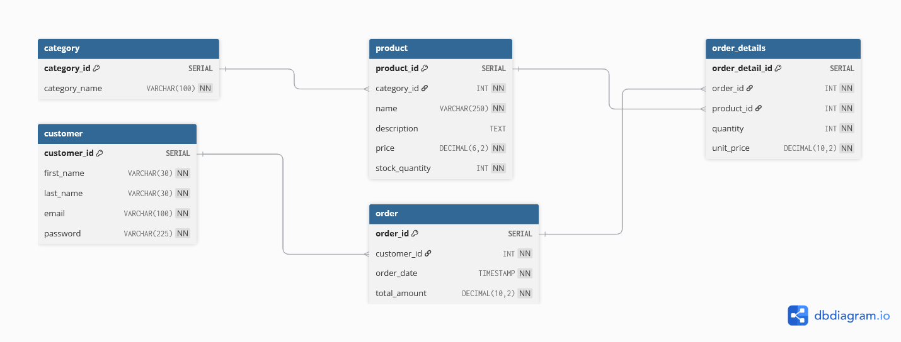

# E-Commerce Database Schema & Queries

## Overview

This project provides a relational database schema for an **E-Commerce System**, along with SQL queries to extract useful reports.

## Database Schema

The database consists of five main tables:

- **Categories**: Stores product categories.
- **Products**: Stores product details and links to categories.
- **Customers**: Stores customer details.
- **Orders**: Stores order details, including total amounts.
- **OrderDetails**: Stores details of each order, linking products to orders.

### Relationships Between Entities

| **Relationship**              | **Type**       | **Description**                                                                 |
|-------------------------------|----------------|---------------------------------------------------------------------------------|
| **Categories → Products**     | One-to-Many    | One category can have many products.                                            |
| **Customers → Orders**        | One-to-Many    | One customer can place many orders.                                             |
| **Orders → OrderDetails**     | One-to-Many    | One order can have many order details.                                          |
| **Products → OrderDetails**   | One-to-Many    | One product can appear in many order details.                                   |

### ERD Diagram

 

## Database Schema Script

```sql
-- Create the database
CREATE DATABASE e-commerce;

-- Create the Categories table
CREATE TABLE Categories (
    category_id SERIAL PRIMARY KEY,
    category_name VARCHAR(100) UNIQUE CHECK(CHAR_LENGTH(category_name) > 3)
);

-- Create the Products table
CREATE TABLE Products (
    product_id SERIAL PRIMARY KEY,
    category_id INT,
    name VARCHAR(250) NOT NULL CHECK(CHAR_LENGTH(name) > 3),
    description TEXT,
    price DECIMAL(6, 2) NOT NULL CHECK(price > 0),
    stock_quantity INT NOT NULL DEFAULT 0,
    FOREIGN KEY (category_id) REFERENCES categories(category_id)
);

-- Create the Customers table
CREATE TABLE Customers (
    customer_id SERIAL PRIMARY KEY,
    first_name VARCHAR(30) NOT NULL CHECK (CHAR_LENGTH(first_name) > 2),
    last_name VARCHAR(30) NOT NULL CHECK (CHAR_LENGTH(last_name) > 2),
    email VARCHAR(100) UNIQUE NOT NULL,
    password VARCHAR(225) NOT NULL CHECK (CHAR_LENGTH(password) > 5)
);

-- Create the Orders table
CREATE TABLE Orders (
    order_id SERIAL PRIMARY KEY,
    customer_id INT,
    order_date TIMESTAMP NOT NULL DEFAULT CURRENT_TIMESTAMP,
    total_amount DECIMAL(10, 2) NOT NULL,
    FOREIGN KEY (customer_id) REFERENCES Customers (customer_id)
);

-- Create the OrderDetails table
CREATE TABLE OrderDetails (
    order_detail_id SERIAL PRIMARY KEY,
    order_id INT NOT NULL,
    product_id INT NOT NULL,
    quantity INT NOT NULL CHECK (quantity > 0),
    unit_price DECIMAL(10, 2) NOT NULL,
    FOREIGN KEY (order_id) REFERENCES Orders (order_id),
    FOREIGN KEY (product_id) REFERENCES Products (product_id)
);
```

## SQL Queries Before & After Optimization 

### 1. Daily Revenue Report for a specific date

**Query:**

```sql
SELECT DATE(order_date) AS OrderDate, SUM(total_amount) AS DailyRevenue
FROM Orders
WHERE DATE(order_date) = '2025-02-03'
GROUP BY DATE(order_date);
```

**Execution Time Before Optimization:** 699.857 ms

**Execution Time After Optimization:** 21.169 ms

**Optimization Techniques:**

- Rewrite the query using a **Range Condition** for the **order date** in the `WHERE` clause:

```sql
SELECT DATE(order_date) AS OrderDate, SUM(total_amount) AS DailyRevenue
FROM Orders
WHERE order_date >= '2025-02-03 00:00:00' AND order_date < '2025-02-04 00:00:00'
GROUP BY DATE(order_date);
```

- Create an **Index** in **(order date)** column on orders table:

```sql
CREATE INDEX idx_orders_order_date ON orders(order_date);
```

### 2. Monthly Top-Selling Products Report

**Query:**

```sql
SELECT 
    TO_CHAR(O.order_date, 'YYYY-MM') AS Month,
    P.name AS ProductName,
    SUM(OD.quantity) AS TotalQuantity
FROM orderdetails OD
JOIN orders O ON O.order_id = OD.order_id
JOIN products P ON P.product_id = OD.product_id
WHERE TO_CHAR(O.order_date, 'YYYY-MM') = '2025-01'
GROUP BY TO_CHAR(O.order_date, 'YYYY-MM'), P.name, P.product_id
ORDER BY TotalQuantity DESC;
```

**Execution Time Before Optimization:** 12894.256 ms

**Execution Time After Optimization:** 2376.915 ms

**Optimization Techniques:**

- Apply Denormalization to Reduce Joins by Combining Data:
  
    **Steps to Apply Denormalization:**
  
    **Step 1**: Create a **Denormalized Table**:
      
    ```sql
    CREATE TABLE denormalized_orders_products(
    	order_id INT , 
    	product_id INT ,
    	product_name VARCHAR(250) NOT NULL CHECK(CHAR_LENGTH(product_name) > 3),
    	order_date TIMESTAMP NOT NULL DEFAULT CURRENT_TIMESTAMP,
    	quantity INT NOT NULL CHECK (quantity > 0)
    );
    ```
    **Step 2**: Filling the Denormalized Table:
    
    ```sql
    INSERT INTO denormalized_orders_products (order_id, product_id, product_name, order_date, quantity)
    SELECT O.order_id, OD.product_id, P.name AS product_name, O.order_date, OD.quantity
    FROM orderdetails OD
    JOIN orders O ON O.order_id = OD.order_id
    JOIN products P ON P.product_id = OD.product_id;
    ```

    **Step 3**: Query the Denormalized Table:
    ```sql
    SELECT 
        TO_CHAR(order_date, 'YYYY-MM') AS Month,
        product_name, SUM(quantity) AS TotalQuantity
    FROM denormalized_orders_products
    WHERE order_date >= '2025-01-01 00:00:00' AND order_date < '2025-02-01 00:00:00'
    GROUP BY TO_CHAR(order_date, 'YYYY-MM'), product_name
    ORDER BY TotalQuantity DESC;
    ```

- Create a **Covering Index** that includes **(order_date,product_name,quantity)**:
    
```sql
CREATE INDEX idx_orderdate_productname_productquantity ON denormalized_orders_products(order_date,product_name,quantity) 
```

### 3. Customers with Orders Totaling More Than \$500 in the Past Month

**Query:**

```sql
SELECT 
    C.first_name || ' ' || C.last_name AS CustomerName,
    SUM(O.total_amount) AS TotalAmount
FROM orders O
JOIN customers C ON O.customer_id = C.customer_id
WHERE O.order_date >= DATE_TRUNC('day', NOW()) - INTERVAL '1 month'
GROUP BY C.customer_id, C.first_name, C.last_name
HAVING SUM(O.total_amount) > 500;
```
**Execution Time Before Optimization:** 4896.671 ms

**Execution Time After Optimization:** 17.112 ms

**Optimization Techniques:**

- Rewrite the query to use a subquery that filters orders first:
```sql
SELECT 
    C.first_name || ' ' || C.last_name AS CustomerName,
    O.total_spent AS TotalAmount
FROM customers C
JOIN (
    SELECT 
        customer_id, 
        SUM(total_amount) AS total_spent
    FROM orders
    WHERE order_date >= DATE_TRUNC('day', NOW()) - INTERVAL '1 month'
    GROUP BY customer_id
    HAVING SUM(total_amount) > 500
) O ON C.customer_id = O.customer_id;
```

- Create a **Covering Index** for **(customer_id, first_name, last_name)** columns in customers table :
```sql
CREATE INDEX idx_customers_id_name ON customers(customer_id, first_name, last_name);
```

- Create a **Covering Index** for **(customer_id, order_date,total_amount)** columns in orders table :
```sql
CREATE INDEX idx_orders_date__customer_amount ON orders(order_date, customer_id, total_amount);
```

### 4. Total Number of Products in Each Category

**Query:**

```sql
SELECT c.category_id, c.category_name, COUNT(p.product_id) AS total_products
FROM categories c LEFT JOIN products p ON c.category_id=p.category_id
GROUP BY c.category_id
ORDER BY c.category_id;
```

**Execution Time Before Optimization:** 184.443 ms

**Execution Time After Optimization:** 23.252 ms

**Optimization Techniques:**

- Rewrite the query to use a subquery that filters products first:
```sql
  SELECT c.category_id, c.category_name, 
       COALESCE(p.product_count, 0) AS total_products
FROM categories c
LEFT JOIN (
    SELECT category_id, COUNT(product_id) AS product_count
    FROM products
    GROUP BY category_id
) p ON c.category_id = p.category_id
ORDER BY c.category_id;
```
- Create an **Index** for **(category_id)** column in the products table:
```sql
CREATE INDEX products_category_index ON products(category_id);
```

### 5. Top Customers by Total Spending

**Query:**

```sql
SELECT c.customer_id, c.first_name || ' ' || c.last_name AS full_name, SUM(o.total_amount) AS total_spending
FROM customers c JOIN orders o ON c.customer_id=o.customer_id
GROUP By c.customer_id
ORDER BY total_spending DESC
LIMIT 10;
```

**Execution Time Before Optimization:** 10888.705 ms

**Execution Time After Optimization:** 4876.360 ms

**Optimization Techniques:**
- Rewrite the query to reduces the amount of data that needs to be joined by aggregating the orders table first:
  
```sql
SELECT c.customer_id, c.first_name || ' ' || c.last_name AS full_name, o.total_spending
FROM customers c
JOIN (
  SELECT customer_id, SUM(total_amount) AS total_spending
  FROM orders
  GROUP BY customer_id
  ORDER BY total_spending DESC
  LIMIT 10
) o ON c.customer_id = o.customer_id
ORDER BY o.total_spending DESC;
```

- Create **Covering Index** for **(customer_id,total_amount)** columns in the orders table:

```sql
 CREATE INDEX idx_orders_customer_total ON orders(customer_id, total_amount);
```

### 6. Most Recent Orders with Customer Information (1000 Orders)

**Query:**

```sql
SELECT o.order_id, o.order_date ,o.total_amount, c.customer_id, c.first_name ||' '|| c.last_name AS full_name, c.email
FROM orders o JOIN customers c ON o.customer_id = c.customer_id
ORDER BY o.order_date DESC 
LIMIT 1000;
```

**Execution Time Before Optimization:** 1014.651 ms

**Execution Time After Optimization:** 0.981 ms

**Optimization Techniques:**

- Create an **Index** for **(order_date)** column in the orders table:

```sql
CREATE INDEX orders_date_index ON orders(order_date);
```

### 7. List of Products with Low Stock (Less than 10)

**Query:**

```sql
SELECT product_id, name , stock_quantity FROM products
WHERE stock_quantity < 10 
ORDER BY stock_quantity ASC;
```

**Execution Time Before Optimization:** 111.096 ms

**Execution Time After Optimization:** 3.975 ms

**Optimization Techniques:**

- Create an **Index** for **(stock_quantity)** column in the products table:

```sql
CREATE INDEX idx_products_stock_quantity ON products(stock_quantity);
```

### 8. Revenue Generated by Each Product Category

**Query:**

```sql
SELECT c.category_id, c.category_name, SUM(od.quantity * od.unit_price) AS total_revenue
FROM categories c
JOIN products p ON c.category_id = p.category_id 
JOIN orderdetails od ON od.product_id=p.product_id  
GROUP BY c.category_id;
```

**Execution Time Before Optimization:** 9535.885 ms

**Execution Time After Optimization:** 5692.432 ms

**Optimization Techniques:**

- Partitione the `orderdetails` table for improved performance.
  
  ```sql
  -- Renme exist orderdetails to orderdetails_old
    ALTER TABLE orderdetails RENAME TO orderdetails_old;
    
    
    -- Create a new partitioned table.
     CREATE TABLE orderdetails (
        order_detail_id SERIAL PRIMARY KEY,
        order_id INT NOT NULL,
        product_id INT NOT NULL,
        quantity INT NOT NULL CHECK (quantity > 0),
        unit_price DECIMAL(10, 2) NOT NULL,
        FOREIGN KEY (order_id) REFERENCES Orders (order_id),
        FOREIGN KEY (product_id) REFERENCES Products (product_id)
    )PARTITION BY RANGE (order_detail_id);
    
    -- Partition 1
    CREATE TABLE orderdetails_p1 PARTITION OF orderdetails
    FOR VALUES FROM (40462) TO (1040461);
    
    -- Partition 2
    CREATE TABLE orderdetails_p2 PARTITION OF orderdetails
    FOR VALUES FROM (1040461) TO (2040461);
    
    -- Partition 3
    CREATE TABLE orderdetails_p3 PARTITION OF orderdetails
    FOR VALUES FROM (2040461) TO (3040461);
    
    -- Partition 4
    CREATE TABLE orderdetails_p4 PARTITION OF orderdetails
    FOR VALUES FROM (3040461) TO (4040461);
    
    -- Partition 5
    CREATE TABLE orderdetails_p5 PARTITION OF orderdetails
    FOR VALUES FROM (4040461) TO (5040461);
    
    -- Partition 6
    CREATE TABLE orderdetails_p6 PARTITION OF orderdetails
    FOR VALUES FROM (5040461) TO (6040461);
    
    -- Partition 7
    CREATE TABLE orderdetails_p7 PARTITION OF orderdetails
    FOR VALUES FROM (6040461) TO (7040461);
    
    -- Partition 8
    CREATE TABLE orderdetails_p8 PARTITION OF orderdetails
    FOR VALUES FROM (7040461) TO (8040461);
    
    -- Partition 9
    CREATE TABLE orderdetails_p9 PARTITION OF orderdetails
    FOR VALUES FROM (8040461) TO (9040461);
    
    -- Partition 10
    CREATE TABLE orderdetails_p10 PARTITION OF orderdetails
    FOR VALUES FROM (9040461) TO (10040465);
    
    -- Copy data from the old table to the new one
    INSERT INTO orderdetails (order_detail_id, order_id, product_id, quantity, unit_price)
    SELECT order_detail_id, order_id, product_id, quantity, unit_price FROM orderdetails_old;
    
    -- Drop the old table once migration is complete.
    DROP TABLE orderdetails_old;
  ```
- Create an **Index** for **(product_id)** column in the orderdetails table:

```sql
CREATE INDEX orderdetails_product ON orderdetails(product_id);
```
**OR (Another Technique Instead of Partitioning)**

- Apply Denormalization to Reduce Joins by Combining Data:
  
    **Steps to Apply Denormalization:**
  
    **Step 1**: Create a **Denormalized Table**:
      
    ```sql
    CREATE TABLE denormaized_orderdetails_products_categories(
    	category_id INT,
    	category_name VARCHAR(100),
    	product_id INT,
    	quantity INT NOT NULL CHECK (quantity > 0),
    	unit_price DECIMAL(10, 2) NOT NULL
    )
    ```
    **Step 2**: Filling the Denormalized Table:
    
    ```sql
    INSERT INTO denormaized_orderdetails_products_categories (category_id,category_name,product_id,quantity,unit_price)
    SELECT c.category_id, c.category_name, od.quantity, od.unit_price
    FROM categories c 
    JOIN products p ON c.category_id = p.category_id 
    JOIN orderdetails od ON od.product_id=p.product_id;
    ```

    **Step 3**: Query the Denormalized Table:
    ```sql
    SELECT category_id, category_name, SUM(quantity * unit_price) AS total_revenue
    FROM denormaized_orderdetails_products_categories
    GROUP BY category_id,category_name;
    ```

##

